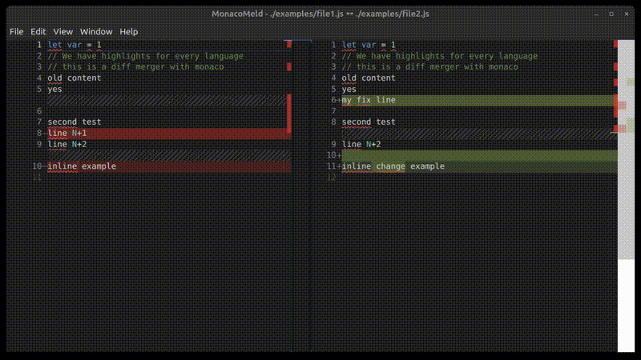

# monaco-meld 

A drop in replacement for meld with monaco diff. A lightweight Electron based app for fast diffing 2 files.

<p align="center">
  
</p>

## Features

- Hopefully lightweight, so fast start
- Arrow based navigation
  - ⌥ Alt + ⬆︎: Navigate to previous change
  - ⌥ Alt + ⬇︎: Navigate to next change
  - ⌥ Alt + ⬅︎: Accept current change from right to left
- Editor switching
  - Ctrl + ⬆︎: Switch to previous editor
  - Ctrl + ⬇︎: Switch to next editor
- Syntax highlighting with Monaco

## Usage

Basic file comparison:
```sh
monacomeld file1.js file2.js
```

Compare file with stdin content:
```sh
echo "modified content" | ./monacomeld file1.js -
```

Compare with multiline content:
```sh
monacomeld file1.js - <<'EOF'
new content here
with multiple lines
EOF
```

### Web Mode Usage

In web mode, you can also send diffs via HTTP:

curl -X POST http://localhost:3000/diff \
  -H "Content-Type: application/json" \
  -d '{
    "leftPath": "examples/file1.js",
    "rightPath": "examples/file2.js"
  }'

Or with direct content:
curl -X POST http://localhost:3000/diff \
  -H "Content-Type: application/json" \
  -d '{
    "leftContent": "original content",
    "rightContent": "modified content",
    "leftPath": "file1.js",
    "rightPath": "file2.js"
  }'

To connect to an existing web server instead of starting a new one:
```
./monacomeld-1.0.0.AppImage --no-server
```

## Installation

### Option 1: Install Pre-built Package
# Install electron globally first (required)
```
npm install -g electron
```

# Install the pre-built package

```
npm install -g monacomeld-*.tgz
```

### Option 2: Build and Install from Source

```sh
# Clone the repository
git clone https://github.com/SixZero/monaco-meld
cd monaco-meld

# Install dependencies and build
npm install
npm run build

# Install globally from the built source
npm install -g .
```

### Requirements

Some might need to run .appImages on Ubuntu 24.04:
```sh
sudo apt install libfuse2
```

# Or if you want to build from source:
git clone https://github.com/SixZero/monaco-meld
cd monaco-meld
npm install
npm run build
npm install -g .

### Running

## Building

```sh
npm install
npm run build
```

## Requirements

Some might need to run .appImages on Ubuntu 24.04.

```sh
sudo apt install libfuse2
```

## Troubleshooting

As mentioned in the reference documentation, the problem is that Ubuntu 24.04 implemented new restrictions for AppImage apps, which restricts the use of sandboxes.

If you encounter sandbox-related errors like:
```
FATAL:setuid_sandbox_host.cc(163)] The SUID sandbox helper binary was found...
```

You can either:
1. Run with the --no-sandbox flag (less secure but works everywhere):
```sh
monacomeld --no-sandbox
```

2. Or properly configure the sandbox (recommended for production):
```sh
sudo sysctl -w kernel.unprivileged_userns_clone=1
```

## Known Issues

- You might see a harmless warning about `mime.cache` in the console. This is a known Electron/Chromium issue on some Linux systems and doesn't affect functionality.

## Remote Usage Options

### Option 1: Web Mode (Better Performance)

1. Start the app in web mode on the remote server:
```sh
monacomeld --web
```

2. Set up SSH port forwarding from your local machine:
```sh
ssh -L 3000:localhost:3000 user@remote-host
```

3. Open in your local browser:
```
http://localhost:3000
```

You can specify a different port with the PORT environment variable:
```sh
PORT=8080 monacomeld --web
```
